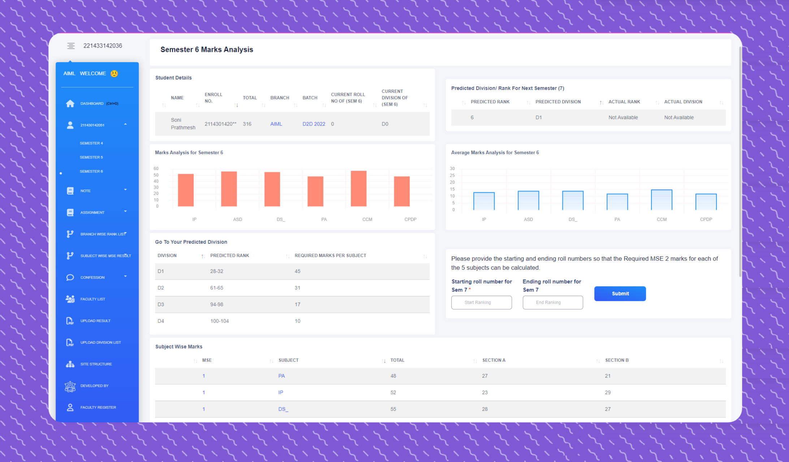

<p id="top" align="center">
  <a href="https://academichub.stuffs.me?ref=logo-github" target="_blank">
    
  </a>
</p>


<h1 align="center" class="dotted">
    <a href="https://academichub.stuffs.me?ref=logo-name-github" target="_blank">   
        AcademicHub
    </a>
</h1>

<br />

<p align="center">


<a href="https://github.com/PrathmeshSoni">

</a> 

</p>

<br />

🎓🔗 AcademicHub: Streamline student connectivity and insights with powerful features. 📊

<br />

# Live Demo 👇:

<a href="https://academichub.stuffs.me?ref=live-link-github" target="_blank">academichub.stuffs.me</a>

<br />

## 🚀 Quick Contribution Info

Want to contribute to this project?

* ✅ **Fork** this repository
* ✅ Apply to contribute: [https://academichub.stuffs.me/contribute/](https://academichub.stuffs.me/contribute/)
* ✅ Check out **Open Issues** here: [https://academichub.stuffs.me/issues/](https://academichub.stuffs.me/issues/)

<br />

## Table Of Contents :

* [About the Project](#about-the-project)
* [Technologies Used](#technologies-used)
* [Features](#features)
* [Getting Started](#getting-started)
  * [Prerequisites](#prerequisites)
  * [Installation](#installation)
* [Credentials](#default-credentials)
* [Screenshots](#screenshots)
* [Contributors](#contributors)
* [Connect Me](#connect-with-me-at)

<br />

## About The Project



Introducing AcademicHub — a dynamic web application designed to streamline the academic journey for college students. This platform offers a comprehensive view of academic information for all students across various departments, focusing on transparency and connectivity. From academic performance insights to a dedicated confession and notes section, AcademicHub fosters a sense of community and engagement.

In addition, AcademicHub provides access to subject-wise GTU exam papers to aid in exam preparation and features a real-time chat window, enabling seamless communication between students and administrators.

<br />

## Technologies Used

* **Backend**: Python & Django
* **Data**: Pandas
* **Frontend**: HTML, CSS, Bootstrap
* **Interactivity**: JavaScript, jQuery, AJAX
* **Database**: MySQL
* **Notifications**: Google Firebase

<br />

## Features

- **Rank Analysis & Academic Transparency**: View academic records across departments, including detailed rank analysis, semester-wise GTU performance, and academic progress.

- **Confession Page**: An open, anonymous platform for students to share confessions and interact through comments, fostering campus engagement.

- **Notes and Resources**: A centralised section for sharing important academic resources, including notes, assignments, and essential updates.

- **Subject Result Upload**: Easily upload subject-wise results in CSV format. The system uses a PDF-to-CSV converter API and auto-inserts data into the database.

- **Real-time Notifications**: Integrates with Google Firebase to send push notifications for announcements and updates.

- **Student Information Search**: Search for any GTU student by enrollment number using `https://academichub.stuffs.me/<Enter-Here-any-Enrollment>/` or use [advanced search](https://academichub.stuffs.me/advanced-student-search/).

- **GTU Result Search**: Quickly find and download GTU results by entering your enrollment number. GitHub: [https://github.com/prathmeshsoni/GTU-Result-Download](https://github.com/prathmeshsoni/GTU-Result-Download)

- **Result Notifications**: Get instant Telegram alerts when GTU results are declared. GitHub: [https://github.com/prathmeshsoni/GtuNotificationBot](https://github.com/prathmeshsoni/GtuNotificationBot)

- **GTU Exam Paper Search**: Instantly retrieve GTU exam papers by entering the subject code.

- **Student-Admin Chat**: Real-time messaging system where students and admins can communicate securely. Live: [https://chat.academichub.stuffs.me/](https://chat.academichub.stuffs.me/) | GitHub: [https://github.com/prathmeshsoni/Chat-Application/](https://github.com/prathmeshsoni/Chat-Application/)

- **Company Placement Management**: Dedicated section where students can view company visit details, job descriptions, recruitment processes, and see showcased profiles of placed students.


> 📌 This repository contains an older version. For the latest updated version, contact: [info@academichub.stuffs.me](mailto:info@academichub.stuffs.me) or visit [Contact for Code](https://academichub.stuffs.me/contact/code/)

<br />

## Getting Started

This is an example of how you may give instructions on setting up your project locally.
To get a local copy up and running, follow these simple example steps.

### Prerequisites

Install Python 3.7 or above

*  <a href="https://python.org/downloads/" target="_blank">Python</a>

### Installation

> 👉 **Step 1** - Download the code from the GH repository (using `GIT`):
```bash
git clone https://github.com/prathmeshsoni/AcademicHub.git && cd AcademicHub
```

<br />

> 👉 **Step 2** - Create virtual environment:
```
python -m venv .venv
```

<br />

> 👉 **Step 3** - Activating the environment:

on Windows:
```bash
.venv\Scripts\activate.bat
```
on Mac OS / Linux:
```bash
source .venv\Scripts\activate
```

<br />

> 👉 **Step 4** - Installing dependencies:

```bash
pip install -r requirements.txt
```

<br />

> 👉 **Step 5** - You can now run the development server:

```bash
python manage.py runserver
```

Visit [`http://127.0.0.1:8000`](http://localhost:8000) in your browser. The app should be up & running.

<br />

## Default Credentials

Admin Panel: [`http://127.0.0.1:8000/admin/`](http://localhost:8000/admin/)

* **Username**: admin
* **Password**: User@1234

<br />

## Screenshots

Visit our <a href="https://project.mrsoni.me/academichub/?ref=screenshots-github" target="_blank">Screenshots Page</a> for a visual walkthrough of the AcademicHub Website.

<br />

## Contributors

|  |  |  |  |  |  |
|:----------------------------------------------------------------------------------------------:|:--------------------------------------------------------------------:|:-----------------------------------------------------------------:|:-----------------------------------------------------------------------:|:------------------------------------------------------------------:|:---------------------------------------------------------------------:|
| [Prathmesh](https://github.com/PrathmeshSoni) | [Manthan](https://github.com/mdakbari) | [Janak](https://github.com/janakDobariya) | [Parshad](https://github.com/parshad-patel) | [Vraj](https://github.com/311vraj) | [Param](https://github.com/ParamShah-Connect) |


<br />
<br />

The repository is a starting point for most of my professional projects; for this, I'm using it as a part of my portfolio. Feel free to use it wherever you want. I'll be happy if you provide any feedback, code improvements or suggestions.

<br />

## Connect with me at

<p align='center'>
  <a href="https://www.linkedin.com/in/PrathmeshSoni/" target="_blank">
    
  </a>
</p>

<p align='center'>
  📫 How to reach me: <a href='mailto:connect.prathmeshsoni@gmail.com'>connect.prathmeshsoni@gmail.com</a>
</p>


## All Set :)

<p style="float:left;" align="left">
  <a href="#top">Back To Top</a>
</p>

<p style="text-align:right;" align="right">
  <a href="https://github.com/PrathmeshSoni/AcademicHub" target="_blank">Back To Repository</a>
</p>


---
**<a href="https://academichub.stuffs.me?ref=footer-github" target="_blank">AcademicHub</a>** - Provided by **<a href="https://soniprathmesh.com?ref=footer-github" target="_blank">Prathmesh Soni</a>**

